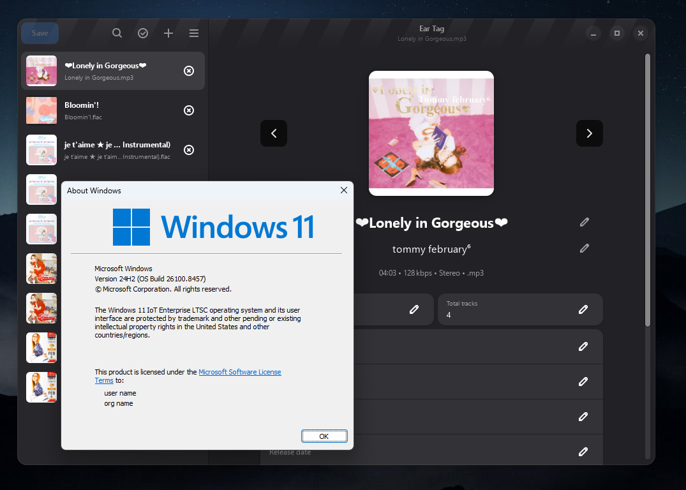

> [!WARNING]
> **This is an unofficial attempt at porting Ear Tag to Windows.**
> The binaries were compiled from original sources without any modifications, except for the final `eartag-devel.py` file.
> The binaries are untested and most likely have their own shitload of problems, please apologize me for that.
> Thank you.

# Ear Tag for Windows

Small and simple audio file tag editor, on Windows.



## About

Ear Tag for Windows is an attempt at making Ear Tag run on Windows.

## Modifications
The source code is unmodified.

The output file `eartag-devel.py` was modified to add environment variables.

```py
# line 20
#...

if getattr(sys, 'frozen', False):
    bundle_dir = sys._MEIPASS if hasattr(sys, '_MEIPASS') else os.path.dirname(sys.executable)
    _internal = os.path.join(bundle_dir, "_internal") if os.path.exists(os.path.join(bundle_dir, "_internal")) else bundle_dir
    os.environ['GI_TYPELIB_PATH'] = os.path.join(_internal, 'girepository-1.0')
    os.environ['XDG_DATA_DIRS'] = os.path.join(_internal, 'share')
    schema_dir = os.path.join(bundle_dir, 'share', 'glib-2.0', 'schemas')
    os.environ['GSETTINGS_SCHEMA_DIR'] = schema_dir
    if hasattr(os, 'add_dll_directory'):
        os.add_dll_directory(bundle_dir)
    
    print(f"Schema Path: {schema_dir}")
    print(f"Contents: {os.listdir(schema_dir)}")

    if hasattr(os, 'add_dll_directory'):
        os.add_dll_directory(_internal)
        os.add_dll_directory(bundle_dir)

     pkgdatadir = os.path.join(bundle_dir, 'share', 'eartag')
     localedir = os.path.join(bundle_dir, 'share', 'locale')
else:
    raise RuntimeError("This script is only meant to be run as a bundled executable.")

sys.path.insert(1, pkgdatadir)
#...
```

## Dependencies

Ear Tag is written in Python, and uses GTK4 and libadwaita for the UI. The following dependencies are required:

- Python >= 3.8
- GTK4 >= 4.12.0
- libadwaita >= 1.4.0
- pygobject
- pillow (used for some picture operations)
- mutagen (used for file tagging)
- python-magic (used for MIME type detection)
- pyacoustid (used for Identify Selected Files option)

## Building
To build Ear Tag for use on Windows, use MSYS2 with GTK 4.0 and all needed dependencies installed.\
You'll also need `meson` and other commands to actually build.

> ```
> meson output
> meson compile -C output
> meson install -C output
> ```
> For development purposes, this is automated in the provided `run` script.

You'll get a script called `eartag-devel.py` in your /tmp/eartag/bin folder. Go there.

Compile schemas bullshit (it won't work otherwise):
```
mkdir -p build/compiled_schemas
cp /C/msys64/mingw64/share/glib-2.0/schemas/*.xml build/compiled_schemas/
cp /C/msys64/tmp/eartag/share/glib-2.0/schemas/*.xml build/compiled_schemas/
glib-compile-schemas build/compiled_schemas/
```
Of course, change /C/msys64/ to your MSYS2 installation path.

Then, install `pyinstaller` to convert all of it to a single EXE:
```
pip install pyinstaller --break-system-packages
```

Now, make an EXE with this command: (replace `C:/msys64/mingw64/` with your MSYS2 installation path)
```
pyinstaller \
  --noconfirm \
  --clean \
  --onefile \
  --noconsole \
  --collect-submodules aiofiles \
  --collect-all gi \
  --collect-all xxhash \
  --collect-submodules PIL \
  --collect-all filetype \
  --collect-all mutagen \
  --collect-all uuid \
  --add-data "C:/msys64/mingw64/lib/girepository-1.0;girepository-1.0" \
  --add-data "build/compiled_schemas;share/glib-2.0/schemas" \
  --add-data "C:/msys64/mingw64/share/icons;share/icons" \
  --add-binary "C:/msys64/mingw64/bin/libadwaita-1-0.dll;." \
  --add-binary "C:/msys64/mingw64/bin/libgraphene-1.0-0.dll;." \
  --add-binary "C:/msys64/mingw64/bin/libgtk-4-1.dll;." \
  eartag-devel.py
```

At the end you're supposed to have a eartag-devel.exe file in `dist/` folder!

